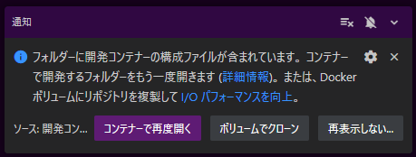

# markdown-view-nuxt3-01
Nuxt3 markdown to html view from LLM responce.

- Nuxt Minimal Starter

## 開発コンテナで起動する方法

1. コマンドラインで、このリポジトリを、git clone
2. クローンした markdown-view-nuxt3-01 フォルダに移動して、vscode で起動します。
   ```bash
   cd markdown-view-nuxt3-01
   code .
   ```
3. vscode が開いたら、右下に、通知されるので、「コンテナーで再度開く」ボタンを押してください。
   
4. しばらく待ちます。
5. LLMは、OpenAI に接続しますので、ご自身のAPIキーを設定してください。
    1. .env.example ファイルをコピーして、.env を作成
        ```bash
        cp .env.example .env
        ```
    2. .envファイルを開き、APIキーを設定

        xxxxxxxxxxxxxxxxxxxxxxxxxxxxx を、ご自身のAPIキーに変更してください。
        ```bash
        OPENAI_API_KEY=xxxxxxxxxxxxxxxxxxxxxxxxxxxxx
        ```

5. 開発モードで、node サーバーを起動
    ```bash
    npm run dev
    ```
6. ブラウザで開く
    ```
    http://localhost:3000
    ```

## 参考にしたHP
- Look at the [Nuxt documentation](https://nuxt.com/docs/getting-started/introduction) to learn more.
- [フロントエンド開発にNuxt３を使おう #初心者 - Qiita](https://qiita.com/KoutaKawaguchi1101/items/e2d138403544e545c177)
- [Nuxt3 × Vuetify3 × LangChain × OpenAIでチャットボットを作成してみた #langchain - Qiita](https://qiita.com/tatsuki-tsuchiyama/items/a156b3d633e3dd89696d)


- [ercel AI SDKを使って簡単にチャット風アプリを作るところまでやってみた #Next.js - Qiita](https://qiita.com/yohei_nakamura/items/d8650d0b2d2ad08bf405)

- [Getting Started: Nuxt #nuxt-quickstart](https://sdk.vercel.ai/docs/getting-started/nuxt#nuxt-quickstart)

- [Vuetify3 の基本 - Zenn](https://zenn.dev/bbled/books/vuetify3_book)

- [chat-with-pdf](https://github.com/RihanArfan/chat-with-pdf?tab=readme-ov-file)

## Setup

Make sure to install dependencies:

```bash

# npm
npm install

# pnpm
pnpm install

# yarn
yarn install

# bun
bun install
```

## Development Server

Start the development server on `http://localhost:3000`:

```bash
# npm
npm run dev

# pnpm
pnpm dev

# yarn
yarn dev

# bun
bun run dev
```

## Production

Build the application for production:

```bash
# npm
npm run build

# pnpm
pnpm build

# yarn
yarn build

# bun
bun run build
```

Locally preview production build:

```bash
# npm
npm run preview

# pnpm
pnpm preview

# yarn
yarn preview

# bun
bun run preview
```

Check out the [deployment documentation](https://nuxt.com/docs/getting-started/deployment) for more information.


## Vuetify3の導入

次に、作成したNuxt3プロジェクトにVuetify3を導入します。

1. 以下のコマンドで、Vuetify3の最新版と、スタイルを適用するのに別途必要なmdiとSASSを開発用の依存関係としてインストールします。

```bash
npm install vuetify@next mdi @mdi/font sass --save-dev
```

2. pluginsディレクトリをルートディレクトリ直下に作成し、その中にvuetify.tsファイルを作成します。vuetify.tsは以下のようにします。

```bash:vuetify.ts
import { createVuetify } from "vuetify";
import * as components from "vuetify/components";
import * as directives from "vuetify/directives";

export default defineNuxtPlugin((nuxtApp) => {
    const vuetify = createVuetify({
        components,
        directives,
    });

    nuxtApp.vueApp.use(vuetify);
});
```

続きは、[Nuxt3 × Vuetify3 × LangChain × OpenAIでチャットボットを作成してみた #langchain - Qiita](https://qiita.com/tatsuki-tsuchiyama/items/a156b3d633e3dd89696d#vuetify3の導入)　を参照してください！！


## OpenAI の アクセスキーを設定

このサーバーからOpenAI のLLMを呼び出していますので、  
ご自身のOpenAIのアカウントのAPIキーを登録してください。

### API登録方法

.env ファイルをルートに新規作成して
```txt:.env
OPENAI_API_KEY=xxxxxxxxxxxxxxxxxxxxxxxxxxxxx
```
xxxxxxxxxxxxxxxxxxxxxxxxxxxxx を、自身のOpenAI のAPIキーを設定してください。

## 実行

### デバック実行
```bash
npm run dev
```
